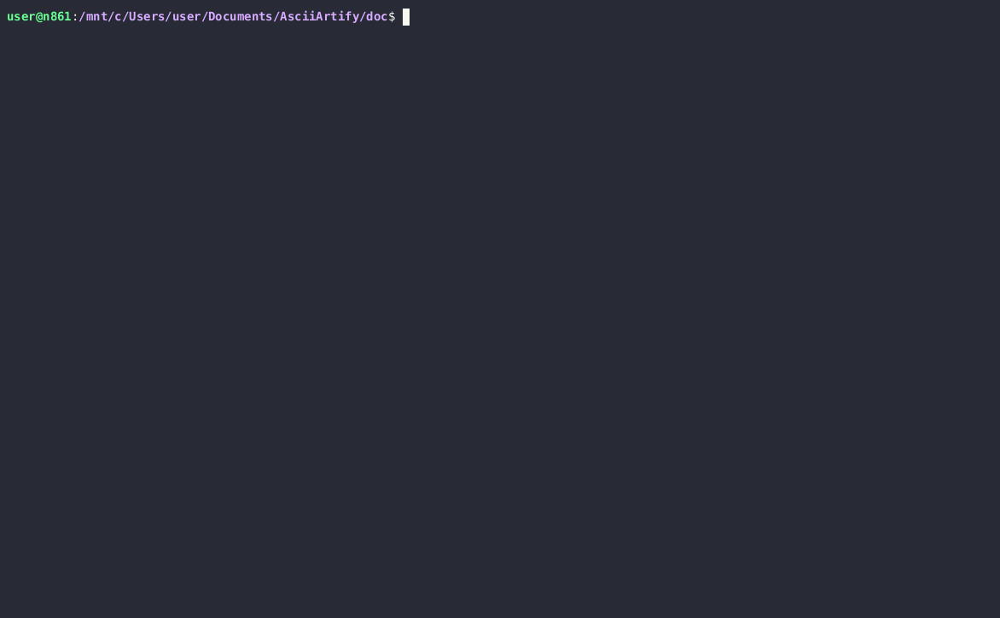

# Kubernetes Deployment Tools Comparing for AsciiArtify

| Feature                    | Minikube                                       | KinD                                            | k3d                                             |
|----------------------------|-------------------------------------------------|-------------------------------------------------|-------------------------------------------------|
| **Ease of Use**             | Beginner-friendly, easy setup                   | Lightweight and efficient, easy setup            | Easy to use, designed for simplicity             |
| **Multi-Node Clusters**     | Supported                                      | Defaults to single-node cluster                 | N/A (single-node by default)                     |
| **Cross-Platform**          | Compatible with Windows, macOS, Linux           | Compatible with various platforms                | Compatible with various platforms                |
| **Resource Intensive**      | Yes                                           | Relatively lightweight                          | Lightweight and efficient                       |
| **Scalability**             | Limited                                       | May lack features of full clusters               | May lack some advanced features                  |
| **Docker Integration**      | No (Not based on Docker)                        | Seamless integration with Docker                | Easily integrates with Docker Compose            |
| **Cluster Creation Time**   | Moderate                                      | Fast cluster creation times                     | Fast cluster creation times                     |
| **Community Support**       | Established community support                   | Growing community support                       | Growing community support                       |

## Demo
k3d  Deployment of "Hello World" Application on Kubernetes

